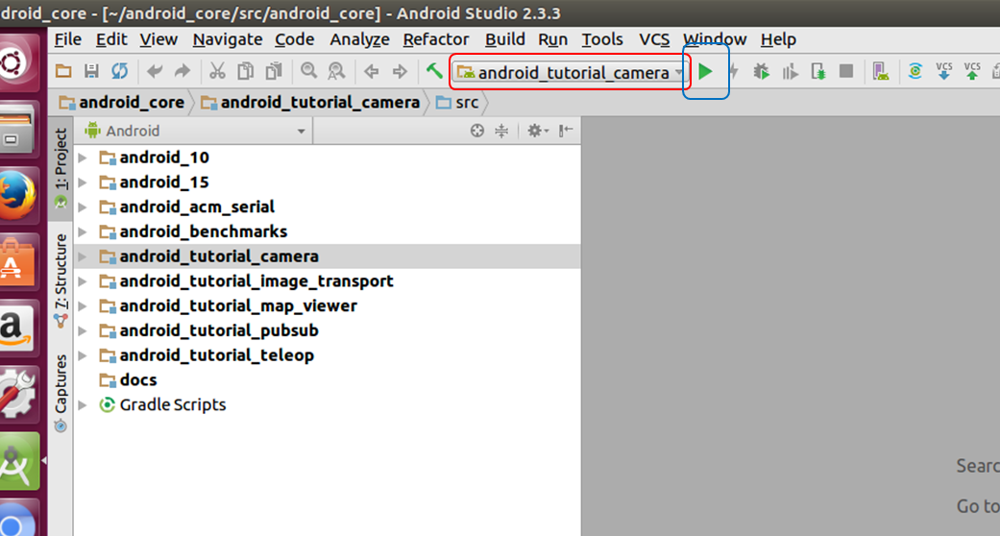
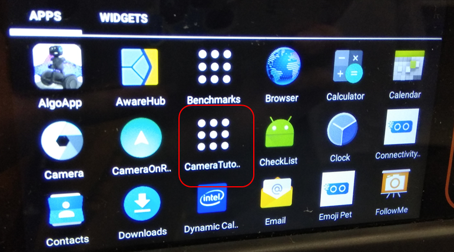
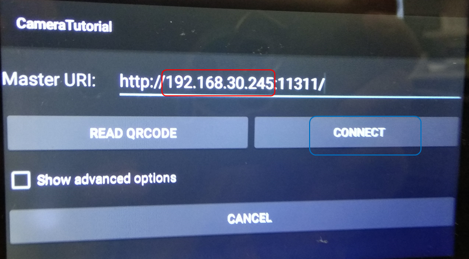

# A loomo robot and a computer: a dream team for area learning
This project demonstrates (1) getting a variety of data from a loomo robot captured by its sensors, such as the color images, the depth images, and the parameters of cameras, and (2) receiving and processing these data on a computer. 
From a robot, data captured by its sensors are published via the middleware framework rosjava to corresponding topics. These topics are subscribed by a program running on a computer which processes the received data and publishes the results to other topics for visualization. 
The communication between a robot and a computer is established by connecting both the robot and the computer to the same Wi-Fi network. In the software level, the ROS framework supports the communication between a loomo robot and a computer as an app (ROS node) for publishing data runs on the robot and the roscore node operates on the computer.
This project has been tested on a computer with Ubuntu 16.04 and ROS kinetic, and android studio 2.3.

## Install the publishing app on loomo
The publishing app publishes the data acquired by the loomo robot via the rosjava framework to corresponding topics. For this purpose, rosjava is used because a loomo robot runs the android OS. Currently the publishing app still undergoes active development. In the near future, it will be provided as an app available for installation from the Google Play store. Now for the completeness of this document, the installation from source of the publishing app is explained in the following. 
Before actually building the app from source, the ROS and android environment should be configured on the computer.
1. Configure the environment
(Test environment: Ubuntu 16.04, ROS kinetic, android studio 2.3.3)
Assume ROS (http://wiki.ros.org/kinetic/Installation) and android studio (http://wiki.ros.org/android/kinetic/Android%20Studio/Download) has been installed.
Then prepare the ROS environment for android development according to (http://wiki.ros.org/android) as summarized below,
	```
	sudo apt-get install ros-kinetic-rosjava-build-tools
	mkdir -p ~/android_core
	wstool init -j4 ~/android_core/src https://raw.github.com/rosjava/rosjava/kinetic/android_core.rosinstall
	source /opt/ros/kinetic/setup.bash
	//You only need to do the next step if you opted for a source installation of rosjava:
	source ~/rosjava/devel/setup.bash
	cd ~/android_core
	catkin_make #If you failed on this step, do this step by root.
	```

2. There are 2 methods to get source code package. And we recommend the 1st method.
1) open a terminal and type below command.
	```
	sudo apt-get install ros-kinetic-rosjava-build-tools ros-kinetic-genjava
	mkdir -p ~/myjava
	wstool init -j4 ~/myjava/src my_java_sources.rosinstall
	source /opt/ros/kinetic/setup.bash
	cd ~/myjava; catkin_make
	source ~/myjava/devel/setup.bash
	cd ~/myjava/src
	git clone git@github.com:segway-robotics/android_core.git
	cd ..
	catkin_make
	```
2)Revise the android_tutorial_camera sample
You will get a catkin workspace android_core after step 1. There is a folder, android_core, in that workspace. And there is a folder, android_tutorial_camera, in that folder. The publishing app is developed mainly based on this sample by modifying several files. The revised files are not disclosed at the moment. Suppose these revised files are at hand, replace the following 6 files in the catkin workspace created in step 1 with the revised ones.

	android_core/src/android_tutorial_camera/src/org/ros/android/android_tutorial_camera/LoomoRosBridgeNode.java
	android_core/src/android_tutorial_camera/src/org/ros/android/android_tutorial_camera/MainActivity.java
	android_core/src/android_10/src/org/ros/android/view/camera/CompressedImagePublisher.java
	android_core/src/android_tutorial_camera/build.gradle
	android_core/src/android_tutorial_camera/res/layout/main.xml
	android_core/src/android_tutorial_camera/res/values/strings.xml

Build from source
	```
	cd ~/android_core
	catkin_make
	```
3. Install and configure the app on loomo
Firstly, connect the computer and loomo through a USB cable.
Secondly, open the android_core project by android studio and choose the program android_tutorial_camera as the build target (Fig. 1), then click run. If successful, there will be an app CameraTutorial shown up on loomo (Fig. 2).

Fig. 1. The backdrop of the android_tutorial_camera sample



Fig. 2. The CameraTutorial app installed on loomo

To enable the robot publishing the acquired data from its sensors, first start the roscore program in a terminal of a computer. Then click the app CameraTutorial on loomo, change the IP address part of the URI blank to the IPv4 address of the computer (note ipconfig in Windows and ifconfig in Linux to check the IP address) and click the connect button (Fig. 3). If everything is OK, there will be a tip showing binding successfully. On the subsequent screen, there are five toggle buttons deciding whether a corresponding data type is published (Fig. 4). By default, nothing is published.

Fig. 3. The GUI of the CameraTutorial app


Fig. 4. The panel of toggle buttons indicating which data to publish. This screen shows that publishing the RGBD data is enabled.

## Install the loomo_vision program on a computer
The loomo_vision program on the computer subscribes to these topics where a robot publishes data at, processes the received data, and publishes the results to other topics, such as pointCloud.
1. To build the program，firstly, create an empty catkin workspace loomo_ws according to (http://wiki.ros.org/catkin/Tutorials/create_a_workspace).
2. Secondly, open a terminal and type the below commands.
	```
	mkdir -p ~/loomo_ws/src
	cd ~/loomo_ws/src
	git clone https://github.com/segway-robotics/vision_msg_proc.git
	cd ..
	catkin_make
	```
## Team up the robot and computer for a demo
1. Run roscore on a computer. Open a terminal, and type
	```
	roscore
	```
2. Start and configure the app on loomo as in Fig. 3 and 4. For now, assume the robot publishes at least the RGBD data.
3. Run the loomo_vision program on the same computer. Open a terminal, and type
	```
	roslaunch loomo_vision vision.launch
	```
4. visualize the pointCloud. Open a terminal, and type
	```
	roscd loomo_vision
	rviz -d ./pclConfig.rviz
	``` 
pclConfig.rviz is in loomo_vision folder.

The rqt_graph depicts the data flow (Fig. 5) for the above demo.


Fig. 5. The relationship between different nodes
